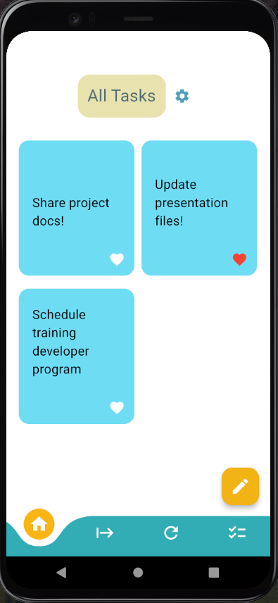

# Your Local Canban App

Its a Flutter mobile app project.

## Getting Started

This project is a little task management application for everyone.

## Splash Screen

Application will be start firstly [Flutter Native Splash](https://pub.dev/documentation/flutter_native_splash/latest/)

## Internationalization

i10n library and flutter_gen used with .arb files [Flutter Internationalization Librariry](https://docs.flutter.dev/accessibility-and-localization/internationalization)

## Local Notification

Tasks are setting with [Local Notification Package](https://pub.dev/packages/flutter_local_notifications)

## State Management

In this project, all task item states and theme states stored with [BLOC](https://bloclibrary.dev/#/)  state management system.

## Usage

- Firstly adding to task by default (Name: Example, Description: Do Homework, Status: Todo).
- If the user wants to add a task who clicks on the pencil icon and enters the information in the window that opens.
- All tasks listed at main page. User can be change using bottom navigation bar sections (All - Todo - InProgress - Done).
- If user click wrote added task item it opens detail page. In this page user can be edit tasks description directly. If user turn back to the main page description changes saving automatically.
- Editing page include task state changer section at the bottom (Icon buttons: Todo - InProgress - Done) and also include theme changer icon (theme: Dark - Light).
- User can be deleted in all tasks in detail page with delete icon button(Trash icon).

## Experimental

This application has no any database connection for 1.0.0 version. Database helpers [Helper1: Hive](https://pub.dev/documentation/hive/latest/) and [Helper2: SqfLite](https://pub.dev/documentation/sqflite/latest/) added the project but has no connection not yet. Its may be include 1.1.0 version or next version.

## Testing

This application contain special testing for only Task BLOC stating.
These tests did [Bloc Test](https://pub.dev/documentation/bloc_test/latest/) package.

## Next Steps

- Database connection
- Language settings (EN/SP/TR/DE) (Checked)
- Special code refactoring (Mixins, constants, routing etc.)
- User testing and publish any store

## Screen Shots

1- Main Page:

2- Add Task:

3- Change Your Language:

4- Task Detail Page:

5- Detail Page with Dark Theme (Dark Theme Applied Whole Project this just a sample):

6- Todo Page:

7- InProgress Page:

8- Done Page:

